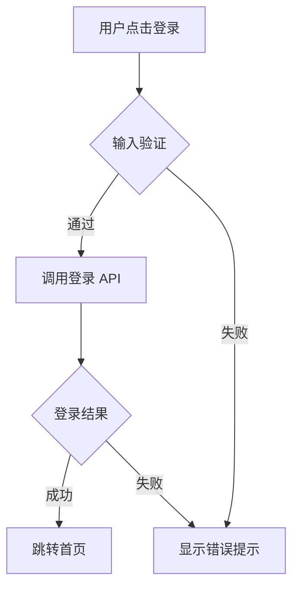

# 技术方案生成规则

本文件定义了从需求文档生成技术方案的规则和模板。

---

## 1. 技术方案结构

生成的技术方案应包含以下章节：

```markdown
# [功能名称] 技术方案

## 1. 需求概述
- 简要描述需求背景和目标
- 引用需求文档：[需求文档](./requirements/xxx.md)

## 2. 技术选型
- 框架/库选择及理由
- 第三方服务依赖

## 3. 数据结构设计
- 核心数据模型
- 状态管理方案
- API 接口契约（引用 API 文档）

## 4. 模块划分
- 页面/组件拆分
- 目录结构规划
- 模块依赖关系

## 5. 关键流程
- 核心业务流程图（Mermaid flowchart）
- 状态流转说明

## 6. 接口对接
- 引用 API 文档：[接口文档](./api/xxx.md)
- 请求/响应示例

## 7. 风险与约束
- 技术风险点
- 性能考量
- 兼容性要求
```

---

## 2. 工作流规则

### 生成技术方案前

1. **必须先读取需求文档**：使用 `get_requirement` 获取需求内容
2. **检查是否有 API 文档**：使用 `list_workspace_files` 查看可用文档
3. **了解项目配置**：使用 `get_workspace_config` 获取框架和技术栈信息

### 生成技术方案时

1. **展示方案大纲**：先向用户展示技术方案的章节大纲
2. **等待用户确认**：用户确认后再生成完整内容
3. **使用 save_document 保存**：保存到 `.aiwork/designs/` 目录

---

## 3. 跨文档引用

使用标准 Markdown 链接语法引用其他文档：

```markdown
参见需求文档：[用户登录需求](../requirements/user-login.md)
接口定义见：[用户 API](../api/user-api.md#login)
交互细节见：[登录页交互](../interactions/login-interaction.md)
```

---

## 4. 流程图规范

使用 Mermaid flowchart 描述业务流程：



---

## 5. 状态管理设计

根据项目配置的 `stateManagement` 字段，使用对应的状态管理方案：

### Zustand 示例

```typescript
interface LoginState {
  isLoading: boolean;
  error: string | null;
  user: User | null;
  login: (credentials: Credentials) => Promise<void>;
  logout: () => void;
}
```

---

## 6. 命名规范

- 技术方案文件：`{feature-name}-design.md`（kebab-case）
- 章节标题：使用数字编号（1. 2. 3.）
- 代码示例：使用 TypeScript 类型注解
